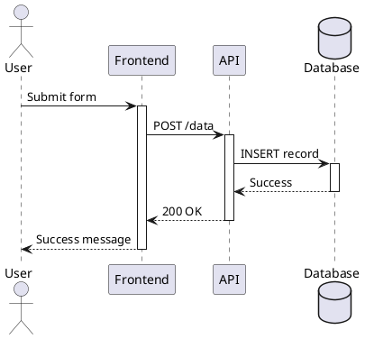
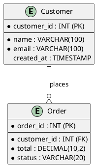
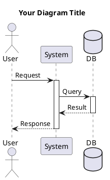
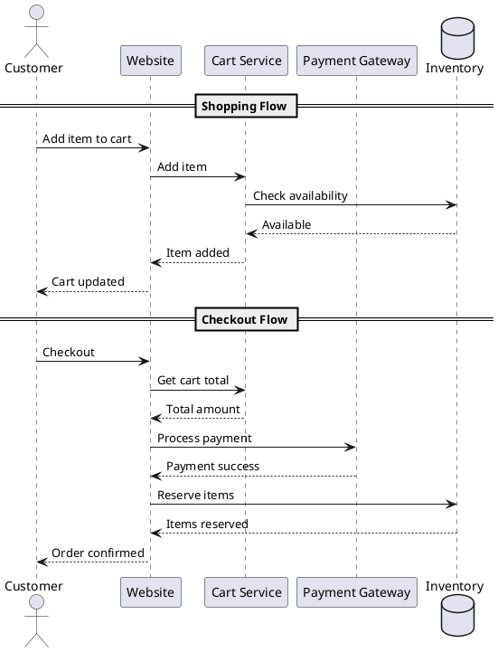
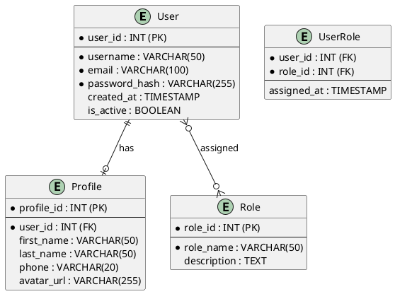

# Sequence Diagrams and ERD Systems Guide

## 📋 **Overview**

This guide explains two essential UML diagram types used in software development and system design:

1. **Sequence Diagrams** - Show object interactions over time
2. **ERD (Entity Relationship Diagrams)** - Show database structure and relationships

Both use **PlantUML** for code-based diagram generation.

---

## 🔄 **Sequence Diagrams**

### **What Are Sequence Diagrams?**

Sequence diagrams are UML diagrams that show how objects interact with each other over time. They visualize the flow of messages between different components of a system.

### **Key Components:**

- **Actors**: External users or systems (stick figures)
- **Objects/Lifelines**: System components (vertical lines)
- **Messages**: Communication between objects (arrows)
- **Activations**: When objects are processing (thick lines)
- **Fragments**: Conditional logic (alt, opt, loop)

### **When to Use:**

✅ **API Design** - Visualize request/response flows  
✅ **System Integration** - Show how components communicate  
✅ **Business Processes** - Model user workflows  
✅ **Debugging** - Identify bottlenecks and issues  
✅ **Documentation** - Explain complex system behaviors  

### **PlantUML Syntax:**



### **Advanced Features:**

1. **Grouping**: Use `==` to group related interactions
2. **Notes**: Add explanatory text with `note left/right`
3. **Loops**: Use `loop` for repeated actions
4. **Conditions**: Use `alt/else` for conditional flows
5. **Timeouts**: Use `opt` for optional interactions

---

## 🗄️ **ERD (Entity Relationship Diagrams)**

### **What Are ERDs?**

ERDs show the relationships between entities in a database or system. They help visualize data structure, relationships, and constraints.

### **Key Components:**

- **Entities**: Tables or objects (rectangles)
- **Attributes**: Fields or properties (inside entities)
- **Relationships**: Connections between entities (lines)
- **Cardinality**: Relationship types (one-to-one, one-to-many, etc.)
- **Keys**: Primary and foreign keys

### **Relationship Types:**

| Symbol | Meaning | Example |
|--------|---------|---------|
| `||--o{` | One-to-Many | Customer has many Orders |
| `||--o|` | One-to-One | User has one Profile |
| `}o--o{` | Many-to-Many | Students take many Courses |

### **When to Use:**

✅ **Database Design** - Plan table structures  
✅ **Data Modeling** - Understand data relationships  
✅ **System Architecture** - Visualize data dependencies  
✅ **Requirements Analysis** - Clarify business rules  
✅ **Documentation** - Document data structure  

### **PlantUML Syntax:**



---

## 🛠️ **PlantUML Setup & Usage**

### **Installation:**

1. **VS Code Extension**: Install "PlantUML" extension
2. **Online Editor**: Use [PlantUML Online Server](http://www.plantuml.com/plantuml/uml/)
3. **Local Installation**: Install Java + PlantUML JAR

### **Basic Syntax:**



### **Styling Options:**

```plantuml
!theme plain
skinparam backgroundColor #f8fafc
skinparam sequenceArrowThickness 2
skinparam roundcorner 20
```

---

## 📊 **Real-World Examples**

### **E-commerce System Sequence:**



### **User Management ERD:**



---

## 🎯 **Best Practices**

### **Sequence Diagrams:**

1. **Keep it Simple**: Focus on one use case per diagram
2. **Use Meaningful Names**: Clear participant and message names
3. **Group Related Actions**: Use `==` to organize sections
4. **Show Error Handling**: Include error scenarios
5. **Limit Participants**: Too many lifelines make diagrams complex

### **ERDs:**

1. **Normalize Data**: Follow database normalization rules
2. **Use Consistent Naming**: Follow naming conventions
3. **Show All Relationships**: Include foreign keys and constraints
4. **Document Constraints**: Add notes for business rules
5. **Keep it Readable**: Use proper spacing and layout

### **PlantUML Tips:**

1. **Use Themes**: Apply consistent styling
2. **Add Comments**: Explain complex logic
3. **Version Control**: Track diagram changes
4. **Export Options**: Generate PNG, SVG, or PDF
5. **Reuse Components**: Create reusable diagram fragments

---

## 🔧 **Integration with Development**

### **In Code Documentation:**

```javascript
/**
 * @sequence
 * @startuml
 * User -> API: POST /orders
 * API -> DB: Create order
 * API -> Payment: Process payment
 * API --> User: Order confirmation
 * @enduml
 */
function createOrder(orderData) {
    // Implementation
}
```

### **In Database Schema:**

```sql
-- ERD: Customer ||--o{ Order
CREATE TABLE customers (
    customer_id INT PRIMARY KEY,
    name VARCHAR(100) NOT NULL,
    email VARCHAR(100) UNIQUE NOT NULL
);

CREATE TABLE orders (
    order_id INT PRIMARY KEY,
    customer_id INT NOT NULL,
    total DECIMAL(10,2) NOT NULL,
    FOREIGN KEY (customer_id) REFERENCES customers(customer_id)
);
```

---

## 📈 **Tools and Resources**

### **Online Tools:**
- [PlantUML Online Server](http://www.plantuml.com/plantuml/uml/)
- [Draw.io](https://draw.io/) - Free diagram tool
- [Lucidchart](https://www.lucidchart.com/) - Professional diagrams

### **VS Code Extensions:**
- PlantUML
- Mermaid Preview
- Draw.io Integration

### **Documentation:**
- [PlantUML Official Documentation](https://plantuml.com/)
- [UML Sequence Diagram Guide](https://www.uml-diagrams.org/sequence-diagrams.html)
- [Database Design Best Practices](https://www.databasestar.com/database-design/)

---

## ✅ **Summary**

Both Sequence Diagrams and ERDs are essential tools for:

- **System Design**: Understanding component interactions
- **Database Planning**: Structuring data relationships  
- **Team Communication**: Visualizing complex concepts
- **Documentation**: Creating maintainable system docs
- **Problem Solving**: Identifying issues and bottlenecks

**PlantUML** provides a code-based approach that integrates well with development workflows and version control systems.

---

*This guide provides the foundation for creating effective system diagrams that enhance understanding and communication across development teams.*
