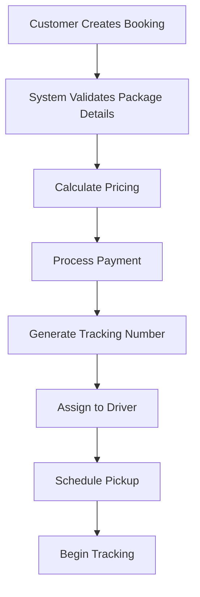
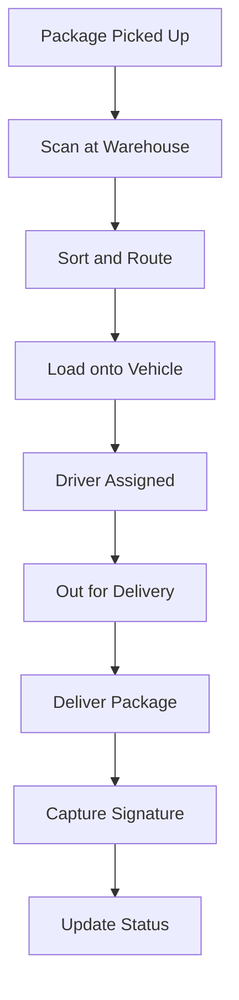
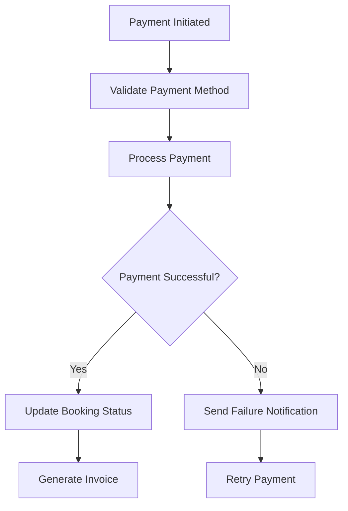

# Enhanced ERD Documentation - Reliable Carriers

## 📋 **Overview**

This enhanced ERD represents a comprehensive logistics and delivery management system for Reliable Carriers, incorporating advanced business logic, operational workflows, and real-world logistics scenarios.

---

## 🏗️ **System Architecture**

### **Core Business Domains:**

1. **Customer Management** - Multi-type customer support with address management
2. **Package & Booking** - Comprehensive shipping and delivery operations
3. **Payment & Finance** - Multi-method payment processing and invoicing
4. **Tracking & Logistics** - Real-time package tracking and delivery management
5. **Operations** - Warehouse, route, and vehicle management
6. **Support & Communication** - Customer service and notification systems

---

## 🎯 **Key Enhancements**

### **1. Advanced Customer Management**

#### **Customer Types:**
- **Individual**: Personal customers with standard pricing
- **Business**: Corporate clients with volume discounts
- **Wholesale**: High-volume customers with special terms

#### **Address Management:**
```sql
-- Multiple address types per customer
CREATE TABLE customer_addresses (
    address_id INT PRIMARY KEY,
    customer_id INT NOT NULL,
    address_type ENUM('billing', 'shipping', 'pickup', 'delivery'),
    address_line1 VARCHAR(100) NOT NULL,
    -- ... other fields
    FOREIGN KEY (customer_id) REFERENCES customers(customer_id)
);
```

#### **Business Logic:**
- **Credit Limits**: Different limits based on customer type
- **Payment Terms**: Net 30 for business, immediate for individual
- **Tax ID**: Required for business/wholesale customers

### **2. Comprehensive Package Management**

#### **Package Types:**
- **Box**: Standard cardboard boxes
- **Envelope**: Document envelopes
- **Pallet**: Large palletized shipments
- **Fragile**: Special handling required
- **Oversized**: Non-standard dimensions

#### **Dimensional Weight Calculation:**
```sql
-- Calculate dimensional weight for air freight
UPDATE packages 
SET dimensional_weight = (length * width * height) / 166
WHERE package_type IN ('box', 'envelope');
```

#### **Special Handling:**
- **Fragile Items**: Extra padding and careful handling
- **Temperature Control**: Refrigerated or heated transport
- **Hazardous Materials**: Special permits and handling
- **High Value**: Additional insurance and security

### **3. Advanced Service Types**

#### **Service Features:**
- **Base Pricing**: Fixed cost per shipment
- **Weight-Based**: Price per kilogram
- **Volume-Based**: Price per cubic meter
- **Time Guarantees**: Delivery time commitments
- **Signature Requirements**: Proof of delivery
- **Insurance Inclusion**: Built-in coverage

#### **Service Examples:**
```sql
INSERT INTO service_types VALUES
(1, 'Express Delivery', 'EXP', 'Next day delivery', 25.00, 2.50, 150.00, 1, 50.0, '100x100x100', true, true, true),
(2, 'Standard Ground', 'STD', '3-5 business days', 15.00, 1.50, 100.00, 4, 100.0, '200x200x200', false, false, true),
(3, 'Economy', 'ECO', '7-10 business days', 10.00, 1.00, 75.00, 8, 200.0, '300x300x300', false, false, false);
```

### **4. Financial Management**

#### **Payment Methods:**
- **Credit/Debit Cards**: Online payment processing
- **Bank Transfer**: ACH and wire transfers
- **Cash**: On-site payments
- **Check**: Business payments
- **PayPal**: Digital wallet integration

#### **Invoice Management:**
```sql
-- Generate monthly invoices for business customers
INSERT INTO invoices (customer_id, invoice_number, invoice_date, due_date, subtotal, tax_amount, total_amount)
SELECT 
    c.customer_id,
    CONCAT('INV-', YEAR(CURDATE()), '-', LPAD(MONTH(CURDATE()), 2, '0'), '-', LPAD(c.customer_id, 6, '0')),
    CURDATE(),
    DATE_ADD(CURDATE(), INTERVAL c.payment_terms DAY),
    SUM(b.final_amount),
    SUM(b.tax_amount),
    SUM(b.final_amount + b.tax_amount)
FROM customers c
JOIN bookings b ON c.customer_id = b.customer_id
WHERE c.customer_type IN ('business', 'wholesale')
  AND b.payment_status = 'pending'
  AND b.created_at >= DATE_SUB(CURDATE(), INTERVAL 1 MONTH)
GROUP BY c.customer_id;
```

### **5. Real-Time Tracking System**

#### **GPS Integration:**
```sql
-- Store GPS coordinates for real-time tracking
INSERT INTO tracking (package_id, status, location, latitude, longitude, description, timestamp)
VALUES (123, 'in_transit', 'Distribution Center - Chicago', 41.8781, -87.6298, 'Package scanned at sorting facility', NOW());
```

#### **Status Workflow:**
1. **Created**: Booking confirmed
2. **Picked Up**: Package collected from sender
3. **In Transit**: Moving through network
4. **Out for Delivery**: Assigned to driver
5. **Delivered**: Successfully delivered
6. **Returned**: Package returned to sender
7. **Lost**: Package cannot be located

#### **Signature Capture:**
```sql
-- Store delivery signature
UPDATE tracking 
SET signature_name = 'John Smith',
    signature_image = '/signatures/123_2024-01-15.jpg',
    actual_delivery = NOW()
WHERE package_id = 123 AND status = 'delivered';
```

### **6. Fleet Management**

#### **Vehicle Types:**
- **Van**: Small packages and local deliveries
- **Truck**: Large shipments and pallets
- **Motorcycle**: Quick document delivery
- **Bicycle**: Eco-friendly urban delivery

#### **Maintenance Scheduling:**
```sql
-- Schedule vehicle maintenance
UPDATE vehicles 
SET next_maintenance = DATE_ADD(last_maintenance, INTERVAL 6 MONTH)
WHERE vehicle_type = 'truck';

UPDATE vehicles 
SET next_maintenance = DATE_ADD(last_maintenance, INTERVAL 3 MONTH)
WHERE vehicle_type = 'van';
```

### **7. Route Optimization**

#### **Route Planning:**
```sql
-- Create optimized delivery routes
INSERT INTO routes (route_name, start_location, end_location, estimated_duration, distance_km)
VALUES ('Downtown Express', 'Warehouse A', 'Downtown District', 240, 15.5);

-- Add route stops in order
INSERT INTO route_stops (route_id, stop_order, location, latitude, longitude, estimated_time, stop_type)
VALUES 
(1, 1, '123 Main St', 41.8781, -87.6298, '09:00:00', 'pickup'),
(1, 2, '456 Oak Ave', 41.8791, -87.6288, '10:30:00', 'delivery'),
(1, 3, '789 Pine St', 41.8801, -87.6278, '11:45:00', 'delivery');
```

### **8. Support & Communication**

#### **Ticket Management:**
```sql
-- Create support ticket
INSERT INTO support_tickets (customer_id, booking_id, ticket_number, subject, description, priority, status)
VALUES (456, 789, 'TKT-2024-001', 'Package not delivered', 'Package was supposed to be delivered yesterday', 'high', 'open');
```

#### **Notification System:**
```sql
-- Send delivery notifications
INSERT INTO notifications (customer_id, notification_type, subject, message, status)
VALUES 
(456, 'email', 'Package Delivered', 'Your package has been successfully delivered', 'pending'),
(456, 'sms', 'Delivery Complete', 'Package delivered to 123 Main St', 'pending');
```

---

## 🔄 **Business Workflows**

### **1. Package Booking Workflow**



### **2. Delivery Process**



### **3. Payment Processing**



---

## 📊 **Data Analytics & Reporting**

### **Key Performance Indicators:**

#### **Operational Metrics:**
```sql
-- Delivery success rate
SELECT 
    COUNT(CASE WHEN status = 'delivered' THEN 1 END) * 100.0 / COUNT(*) as success_rate
FROM packages 
WHERE created_at >= DATE_SUB(NOW(), INTERVAL 30 DAY);

-- Average delivery time
SELECT 
    AVG(DATEDIFF(actual_delivery, created_at)) as avg_delivery_days
FROM tracking 
WHERE status = 'delivered' 
  AND actual_delivery IS NOT NULL;
```

#### **Financial Metrics:**
```sql
-- Monthly revenue by customer type
SELECT 
    c.customer_type,
    SUM(b.final_amount) as total_revenue,
    COUNT(b.booking_id) as total_bookings
FROM customers c
JOIN bookings b ON c.customer_id = b.customer_id
WHERE b.created_at >= DATE_SUB(NOW(), INTERVAL 1 MONTH)
GROUP BY c.customer_type;
```

#### **Customer Analytics:**
```sql
-- Customer retention rate
SELECT 
    COUNT(DISTINCT customer_id) as repeat_customers,
    COUNT(DISTINCT customer_id) * 100.0 / (SELECT COUNT(DISTINCT customer_id) FROM customers) as retention_rate
FROM (
    SELECT customer_id, COUNT(*) as booking_count
    FROM bookings 
    GROUP BY customer_id 
    HAVING COUNT(*) > 1
) repeat_customers;
```

---

## 🔧 **Implementation Considerations**

### **1. Database Optimization**

#### **Indexing Strategy:**
```sql
-- Primary indexes
CREATE INDEX idx_packages_tracking ON packages(tracking_number);
CREATE INDEX idx_bookings_customer ON bookings(customer_id, created_at);
CREATE INDEX idx_tracking_package ON tracking(package_id, timestamp);
CREATE INDEX idx_payments_booking ON payments(booking_id);

-- Composite indexes for common queries
CREATE INDEX idx_packages_status_date ON packages(status, created_at);
CREATE INDEX idx_bookings_status_payment ON bookings(booking_status, payment_status);
```

#### **Partitioning Strategy:**
```sql
-- Partition tracking table by date
ALTER TABLE tracking 
PARTITION BY RANGE (YEAR(timestamp)) (
    PARTITION p2023 VALUES LESS THAN (2024),
    PARTITION p2024 VALUES LESS THAN (2025),
    PARTITION p2025 VALUES LESS THAN (2026)
);
```

### **2. Security Considerations**

#### **Data Encryption:**
```sql
-- Encrypt sensitive customer data
ALTER TABLE customers 
MODIFY COLUMN tax_id VARBINARY(255);

-- Encrypt payment information
ALTER TABLE payments 
MODIFY COLUMN transaction_id VARBINARY(255);
```

#### **Access Control:**
```sql
-- Create role-based access
CREATE ROLE 'driver_role';
GRANT SELECT ON tracking TO 'driver_role';
GRANT UPDATE ON tracking TO 'driver_role';

CREATE ROLE 'admin_role';
GRANT ALL PRIVILEGES ON *.* TO 'admin_role';
```

### **3. Integration Points**

#### **Payment Gateway Integration:**
```javascript
// Payment processing API
async function processPayment(bookingId, paymentMethod, amount) {
    const payment = await createPaymentRecord(bookingId, paymentMethod, amount);
    
    // Integrate with payment gateway
    const gatewayResponse = await paymentGateway.charge({
        amount: amount,
        method: paymentMethod,
        bookingId: bookingId
    });
    
    // Update payment status
    await updatePaymentStatus(payment.id, gatewayResponse.status);
    
    return gatewayResponse;
}
```

#### **GPS Tracking Integration:**
```javascript
// Real-time location updates
async function updatePackageLocation(trackingNumber, latitude, longitude) {
    const package = await getPackageByTracking(trackingNumber);
    
    await createTrackingRecord({
        packageId: package.id,
        status: 'in_transit',
        latitude: latitude,
        longitude: longitude,
        timestamp: new Date()
    });
    
    // Send notification to customer
    await sendLocationUpdate(package.customerId, trackingNumber);
}
```

---

## 🚀 **Future Enhancements**

### **1. AI-Powered Features**
- **Predictive Delivery Times**: Machine learning for ETA calculation
- **Route Optimization**: AI-driven route planning
- **Fraud Detection**: Automated payment fraud detection
- **Customer Behavior Analysis**: Predictive analytics for customer needs

### **2. IoT Integration**
- **Smart Sensors**: Temperature and humidity monitoring
- **Real-time Tracking**: GPS and RFID integration
- **Vehicle Telematics**: Fuel efficiency and maintenance alerts
- **Warehouse Automation**: Automated sorting and routing

### **3. Mobile Applications**
- **Driver App**: Real-time delivery management
- **Customer App**: Package tracking and booking
- **Admin Dashboard**: Comprehensive management interface
- **Analytics Platform**: Business intelligence and reporting

---

## ✅ **Summary**

This enhanced ERD provides a comprehensive foundation for a modern logistics and delivery management system, incorporating:

- **Scalable Architecture**: Supports growth from startup to enterprise
- **Real-time Operations**: Live tracking and status updates
- **Financial Management**: Complete billing and payment processing
- **Customer Experience**: Multi-channel communication and support
- **Operational Efficiency**: Route optimization and fleet management
- **Data Analytics**: Comprehensive reporting and insights

The system is designed to handle the complexities of modern logistics while providing a seamless experience for customers, drivers, and administrators.
